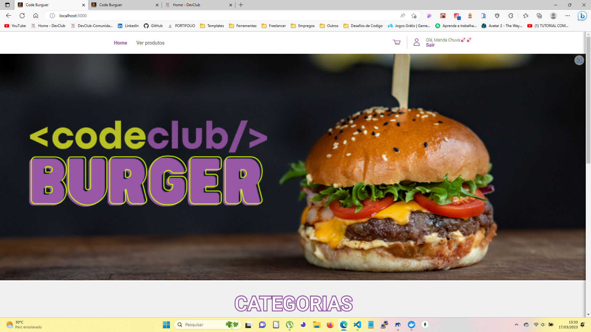
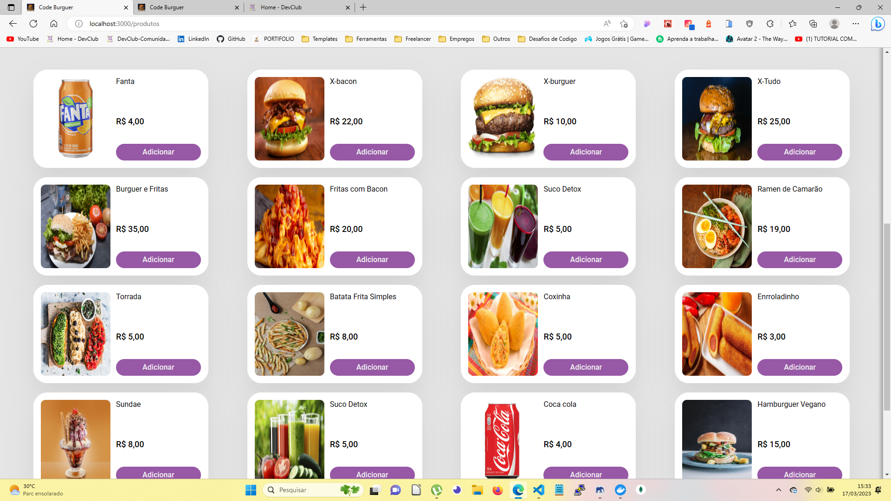
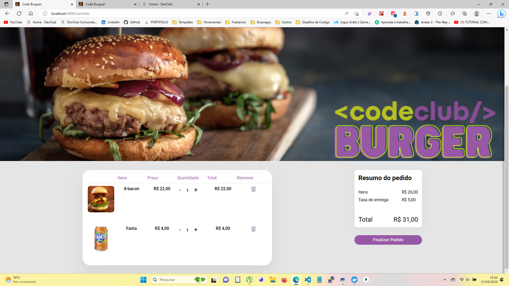
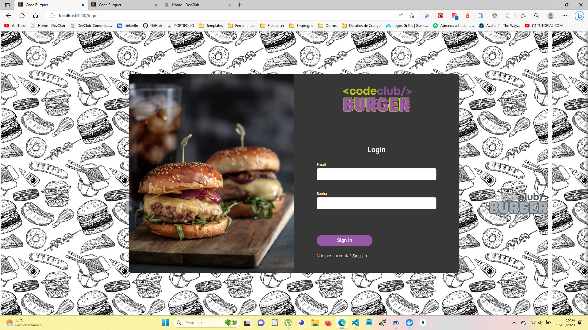
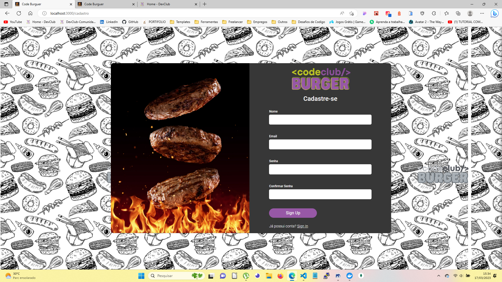
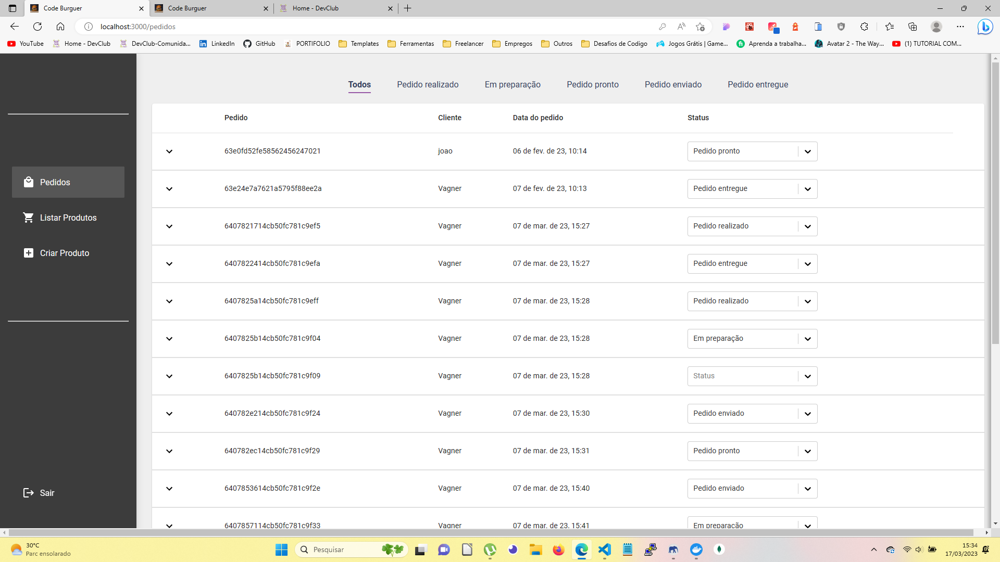
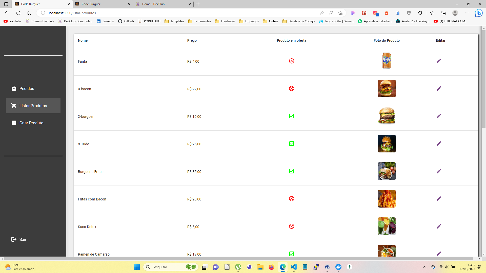
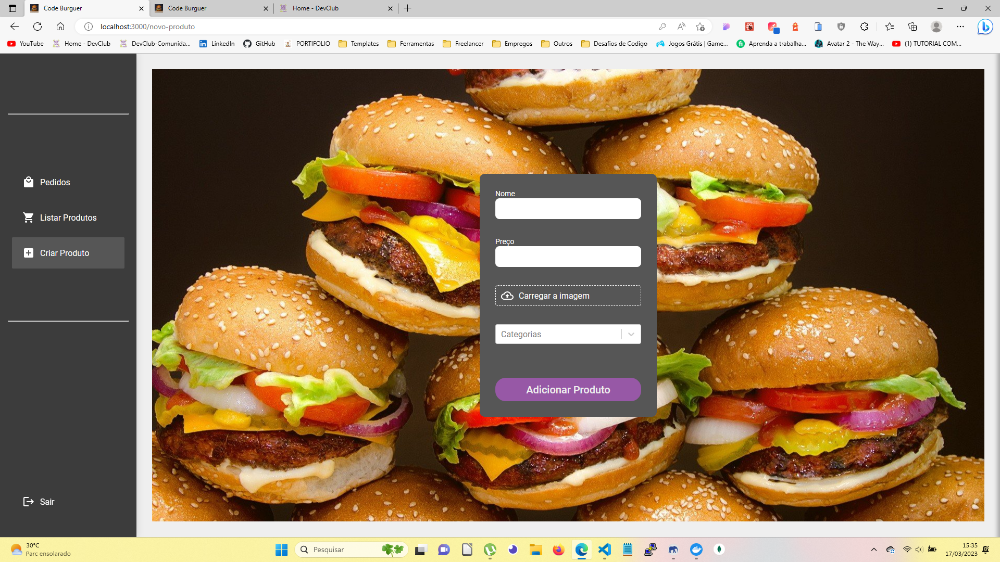

# CodeBurguer

> Resultado do Projeto CodeBurguer.

### Sobre:

O projeto trata-se de um site completo pagina Home, Produtos, Carrinho de compras, Login, Cadastro e Administração.
O projeto ja está no ar e foram usados:

- [x] Criação do React App
- [x] Criação do Styled-Components
- [x] Criação do React Hooks( useState, UseEffect, useHistory, useForm)
- [x] Consumo de Api
- [ ] Responsividade ( em andamento...)

## 🤝 Colaboradores

Agradecemos às seguintes pessoas que contribuíram para este projeto:

<table>
  <tr>
    <td align="center">
      <a href="#">
         
        
          <b>Vagner Santos</b>
        
      </a>
    </td>
  </tr>
</table>

